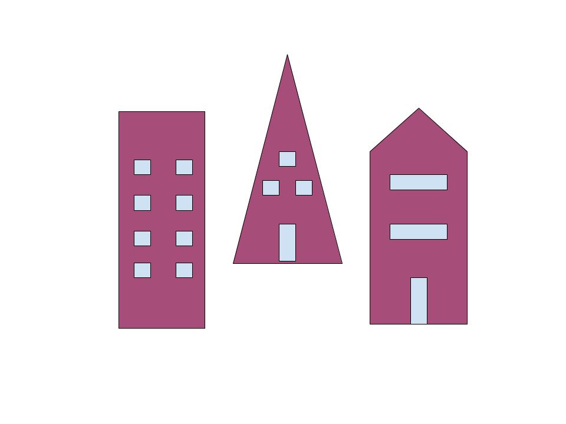

# Collins-Lab-Task-Sets-Program

This program is set up as a video game, and directs participants (playing as building/maitnence managers) through a series 
of cities, where they are responsible for fixing the problems that may occur in various homes.
Participants have the ability to fix multiple problems, and must learn which fix at each house gives them the biggest reward.
The code is organized into 5 main parts: html style set up, text blocks, test blocks, timeline, and initialization. 
The html set up sets the background color and creates the first main page where participants enter their identifying information.
The text blocks are all of the instructional/transition/informational pages that participants see, but don't interact with. 
The test blocks are the actual code for the experiment- they provide the stimuli and code for rewards. They utilize the jsPsych 
"categorize" type, which presents an image and then classifies participant responses as either correct or incorrect and
presents rewards accordingly. 
The timeline psedudorandomizes the order of stimulus presentation into one of three possible timmelines, chosen based on the 
participant's ID number.
The initialization section sets up the data saving function, using the file save_data.php, and actually initializes the
experiment, as well as making the experiment fullscreen and initalizing the actual data collection (saving to a CSV file) 
at the experiment's conclusion. 

Text block example:
This block is set as the type "text", and provides instructions and an intro to the city 1 block. At the end of the text, there
is an image of city 1. 
    /* define town 1 message block */
    var city1_block = {
        type: "text",
        text: "
As the building manager, you'll be responsible for fixing anything that goes wrong in the houses. 
" +
        "
Some houses are more likely to have certain issues. 
" +
        "
Keep that in mind, since your tips will change depending on whether you fix the right problem. 
" +
        "
Good luck on your first day, I know you'll do great! 
" +
        "
</img>",
        
Test block example:
    /* The test blocks defined below are the actual experimental blocks. Each block contains the path to the stimulus
    image, the key that will give the highest reward, and the allowed keys, as well as the text of the feedback message,
     and the length of feedback presentation. "Prompt" refers to the instructions below the image, which prompts the
     subject to take an action. There is a block for each house in each city, as well as for "version 2", in which the three 
     original cities have a new building added to each. */

    /* Test block for city 1, one block per house */
    var c1b1_test_block = {
        type: 'categorize',
        stimulus: 'img/c1b1notify.png',
        key_answer: 74,                           // 74 = j, j will give the largest reward
        choices: [74, 75, 76],                    // 74 = j, 75 = k, 76 = l, pressing any other keys will not lead to a response
        correct_text: "
Thanks for fixing our house! Here's 1 dollar.
",
        incorrect_text: "
Thanks for fixing our house! Here's 0 dollars.
",
        timing_feedback_duration: 3000,
        prompt: "To mow the lawn, press the 'J' key. To repaint the house, press the 'K' key. To fix the pipes, press the 'L' key."
    };
    
    
    
Timeline Example:
var timeline = [];                        //creates the empty array timeline
    timeline.push(welcome_block);         //blocks are pushed to the timeline in a pseudorandomized order
    timeline.push(instructions_block);
    timeline.push(city1_block);           //move to city 1
    timeline.push(c1b3_test_block);
    timeline.push(c1b2_test_block);
    timeline.push(c1b1_test_block);
    timeline.push(c1b3_test_block);
    timeline.push(c1b2_test_block);
    timeline.push(c1b1_test_block);
    timeline.push(c1b2_test_block);
    timeline.push(c1b1_test_block);
    timeline.push(c1b1_test_block);
    
    
Data Collection & Initialization:
        function saveData(subj_id, filedata){                                   //saves data to CSV file
        $.ajax({
            type:'post',
            cache: false,
            url: 'save_data.php',                                               // this is the path to the PHP script
            data: {filename: subj_id, filedata: filedata}
        });
    }

    jsPsych.init({
        timeline: timeline,
        fullscreen: true,
        /*on_finish: function () {                //displays data to subject at experiment conclusion, currently commented out
            jsPsych.data.displayData();
        }, */
        on_finish: function(data){ saveData("filename.csv", jsPsych.data.dataAsCSV()) }     //calls function to save data
    })
